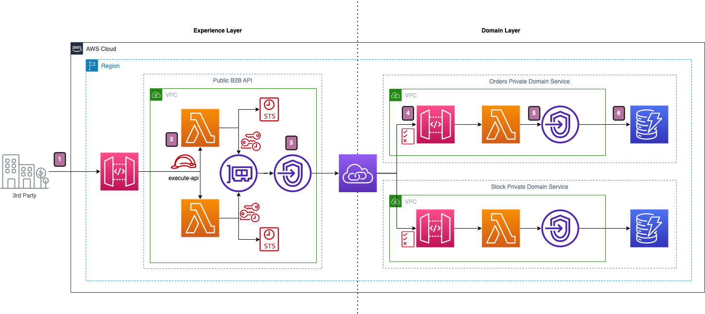

# Serverless API Proxy

An example of a public serverless regional API Gateway API which proxies to internal private domain service APIs.

The article for this repo can be found here: https://blog.serverlessadvocate.com/serverless-api-gateway-federation-6acdd21cdbba

We will be building out the following basic architecture:

The diagram shows:

1. We have B2B customers using our public facing API Gateway.

2. Our Lambda functions have the specific IAM role for the execute-api, which allows them to use IAM Auth and SigV4 to sign the API requests for the underlying private domain API's in the Domain Layer.

3. We use a VPC Interface Endpoint to route traffic through PrivateLink to our internal private API Gateways which are in their own VPCs.

4. The resource policy on the private API Gateway ensures that traffic can only come from a specific VPC Endpoint.

5. If allowed through the resource policy, the backing Lambda function communicates with DynamoDB via a Gateway endpoint.

6. All records are saved and retrieved in/from DynamoDB.

---

** The information provided are my own personal views and I accept no responsibility on the use of the information. **
